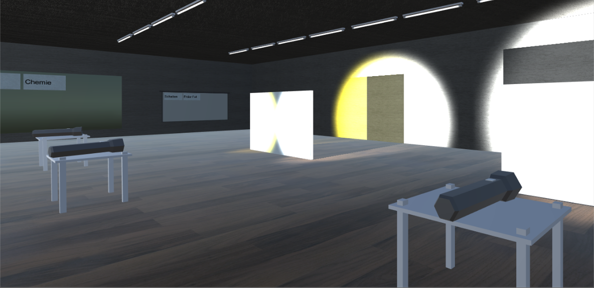

# VREeducation

Eine Virtual Reality-Anwendung zur Lernunterstützung für Schüler, entwickelt für Oculus Rift. Durch die Anwendung können Schüler verschiedene schulische Themen aus den Bereichen Physik und Geographie anhand von simulierten Experimenten in einer 3D-Umgebung interaktiv untersuchen. Über eine Schnittstelle können auf einfache Art und Weise neue Themen und Inhalte in die Anwendung integriert werden. 

Diese Arbeit ist im Rahmen der Bachelorarbeit von [Kevin Gisa](https://github.com/kgisa) an der Hochschule für Technik und Wirtschaft des Saarlandes ([htw saar](https://www.htwsaar.de/)) entstanden. 

---

A virtual reality learning application for students, developed for Oculus Rift. The application allows students to interactively explore a variety of physics and geography-related topics through simulated experiments in a 3D environment. The application can easily be extended by the integration of new topics and content via an interface. 

This project was created as part of the bachelor thesis of [Kevin Gisa](https://github.com/kgisa) at the University of Applied Sciences in Saarbrücken([htw saar](https://www.htwsaar.de/en)).

*Beispiel für die Visualisierung eines Licht- und Schattenexperiments / Example showing the visualisation of a light and shadow experiment*
